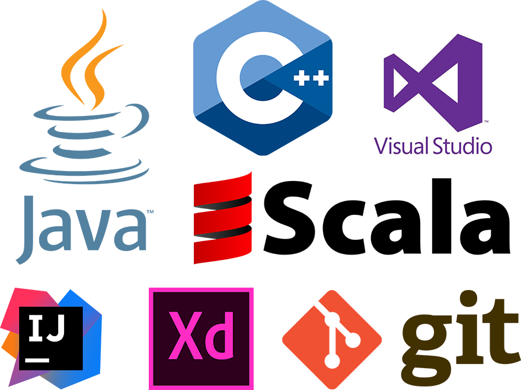

# About Me

Hi, I'm Brandon, I'm a Computer Scientist seeking an internship in Software Engineering. I am skilled in Java and C++ and I have experience in Scala, Python, Javascript, and Swift. Currently I am working on a Chrome Extention to enhance the functionality of SJSU's class registration portal. I love creating things and would jump at the opportunity to create something great.

# Education

Bachelor of Science: Computer Science - San Jose State University 2019

# Skills

*   Java
*   C++
*   Scala
*   Jekyll
*   Git
*   Microsoft Visual Studio
*   IntelliJ
*   Adobe XD

# Favorite Things

1.  Dogs
2.  Coding
3.  Games
4.  Hot Chocolate

[Contact Me!](https://goo.gl/forms/a9pudj0Qp75bmENh1 "Contact Me!")
