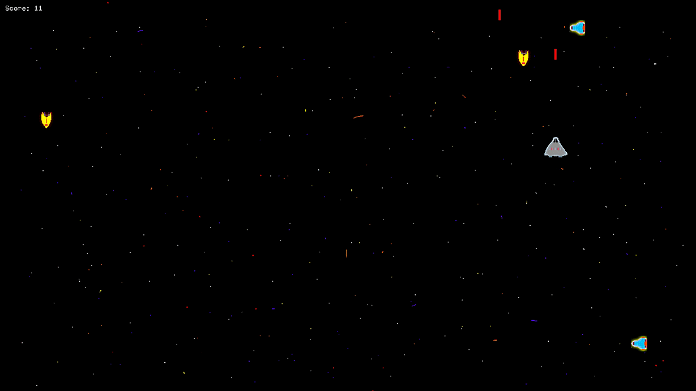
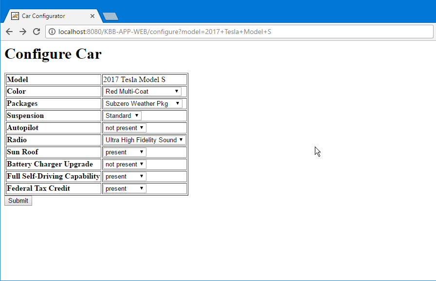
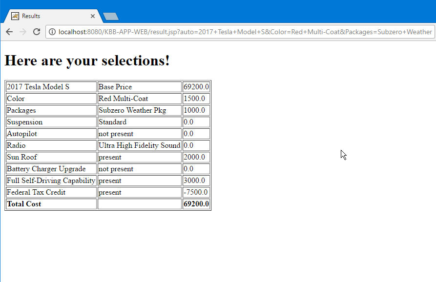

# About Me

Hi, I'm Brandon, I am currently seeking a Software Engineering Internship for Summer and or Fall 2019. I am skilled in Java and C++ and I have experience in C, Scala, Python, Javascript, and Swift. You may see some of the projects I have worked on below. Please contact me using the link above or contact me on LinkedIn, I will get back to you promptly.

# Education

Bachelor of Science: Computer Science - San Jose State University Fall 2019

# Skills

*   Java
*   C++
*   C
*   Scala
*   Git
*   Linux
*   Data Structures & Algorithms
*   OOD Design Patterns
*   Agile Development
*   Microsoft Visual Studio
*   Xcode
*   IntelliJ
*   Adobe XD

# Projects

## Space Shooter Game - 2019

2D Space shooter game built using openFrameworks. Players try to destroy as many enemy spacecraft as possible.

[Link to Code](https://github.com/brandon-a/2D-Shooter){:target="_blank"}

## Lunar Lander Game - 2019

3D Spaceship lander game built using openFrameworks. Players goal is to get points from landing within the designated landing zones.

[Link to Code](https://github.com/brandon-a/lunar-lander){:target="_blank"}

## Whiteboard Project (Group Project) - 2017

Whiteboard application built using Java Swing enabling users to share their whiteboards with others in real time.

[Link to Code](https://github.com/brandon-a/whiteboard){:target="_blank"}

## Car Builder Application - 2017

Car builder application built using a Java backend and an HTML frontend, enables the user to customize car features and see a customized price.

[Link to Code](https://github.com/brandon-a/KBB-Application){:target="_blank"}

## Fun

*   [Favorite Text Editor: VS Code](https://code.visualstudio.com/){:target="_blank"}
*   [Favorite Linux Distribution: Arch Linux](https://www.archlinux.org/){:target="_blank"}
*   [Favorite Shell: Zsh](http://zsh.sourceforge.net/){:target="_blank"}

# [Contact Me!](https://goo.gl/forms/a9pudj0Qp75bmENh1 "Contact Me!")
